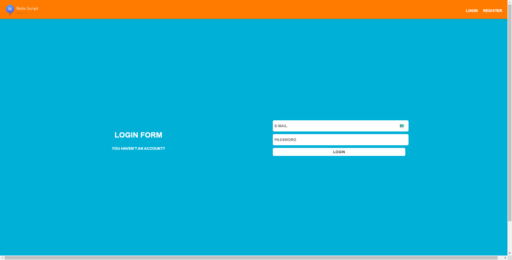
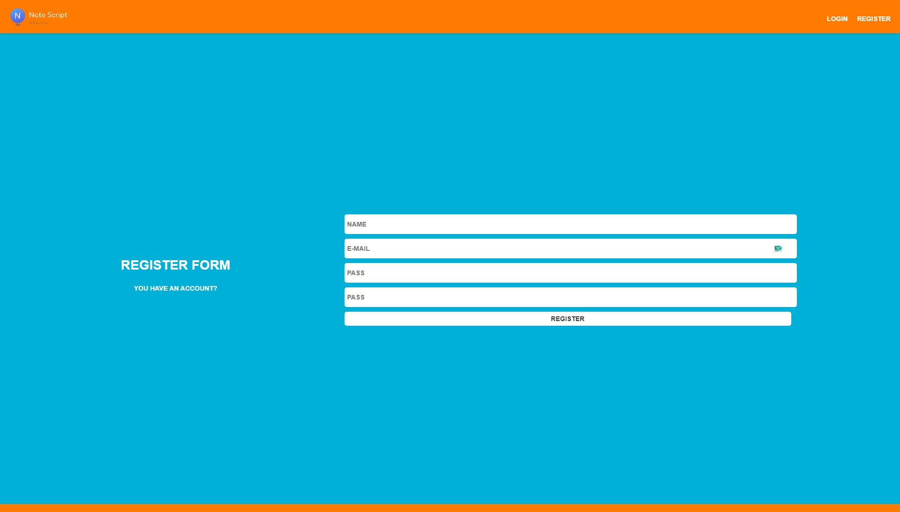
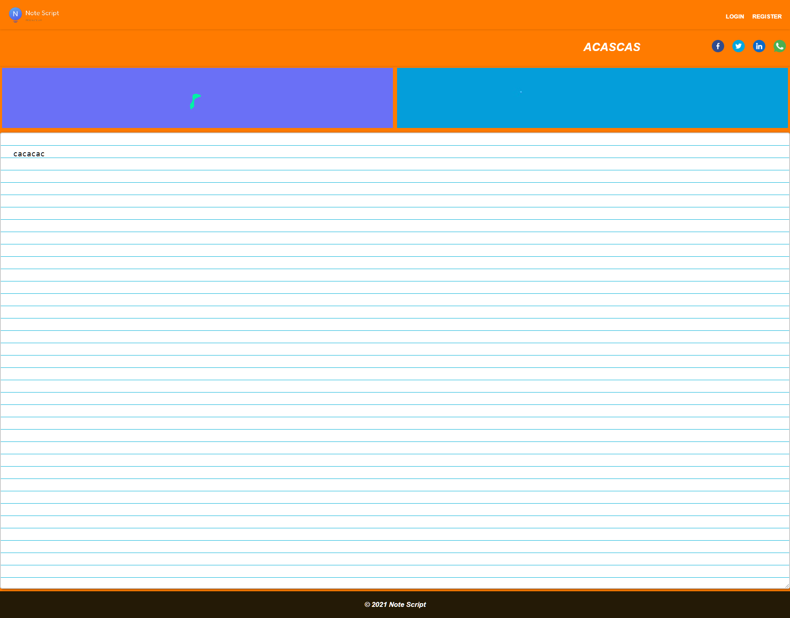

##About This Script

This script was written for simple create note pages. I don't think extra features in the future. 
i wrote this script in about one day

Before installation, you can check the general features here.

###Features

- Admin Page
- User Page
- JQuery Not Included
- Bootsrapt Not Included
- One CSS File
- You can add a banners
- You can add a note title
- This script have a note view counter
- This script have a banner click counter and banner view counter
- System Backup Tool

After installation, please a register. You are a first user and admin role. You don't forget , other users have a default role 'user'

 
#### Screenshots : 

